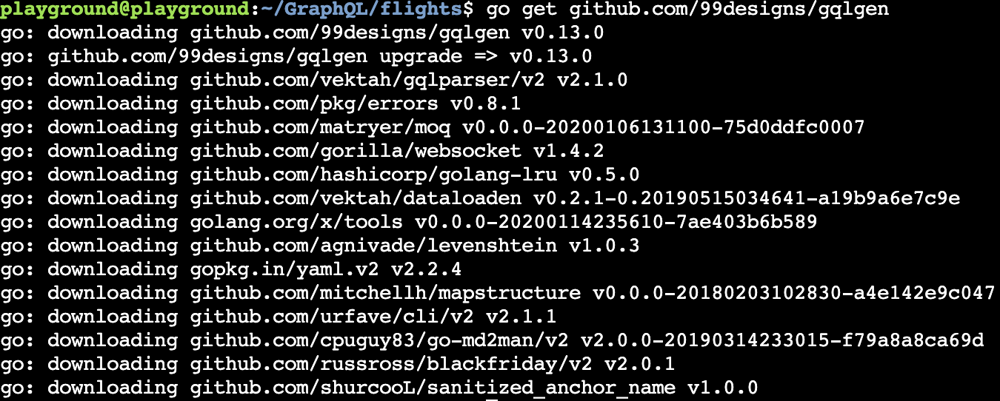
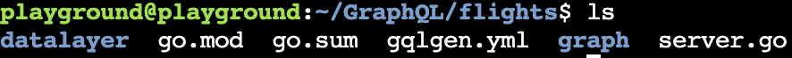
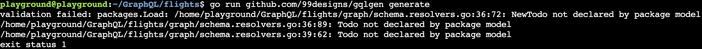
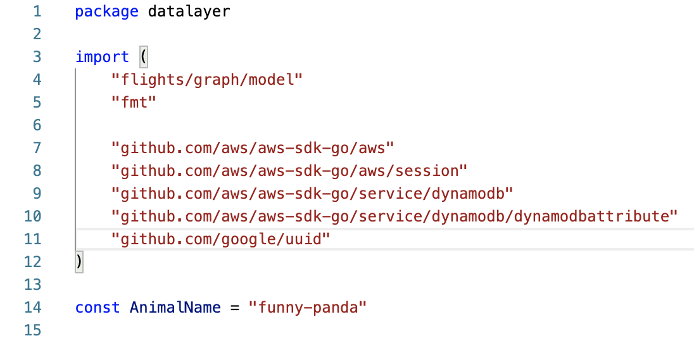
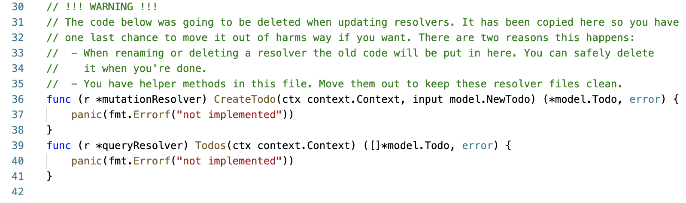
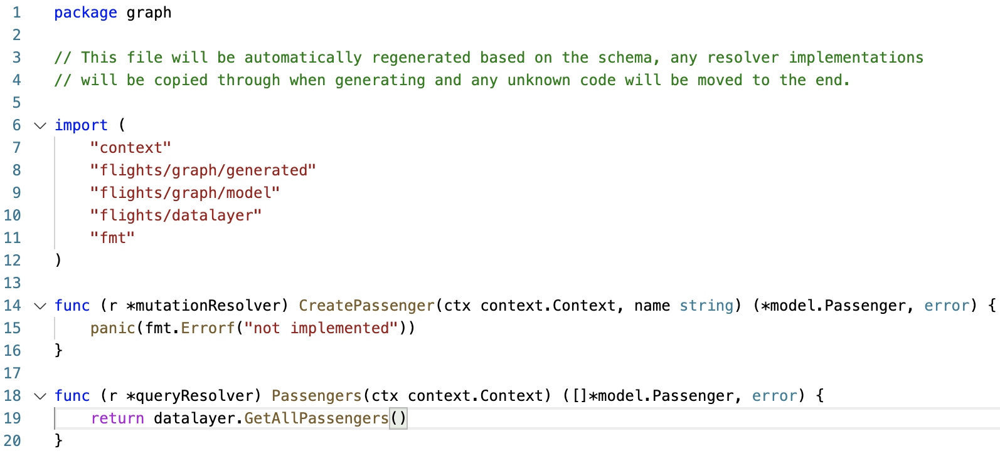
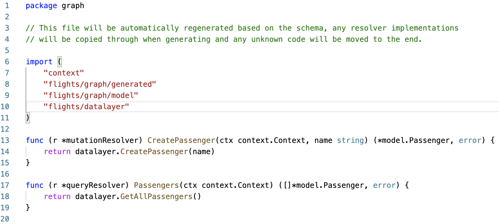
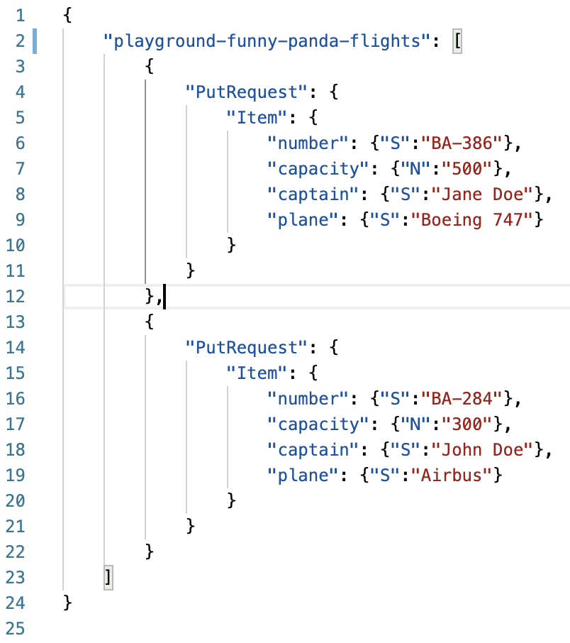
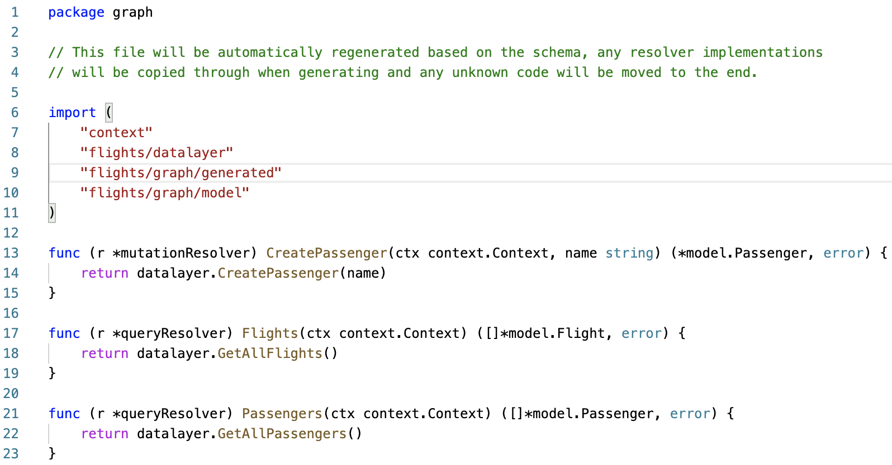

<p align="center">

</p>

<h1 align="center">Welcome to the October playground! Introduction to GraphQL with Go</h1>

[The Playground link](https://github.com/DevOpsPlayground/Introduction-to-GraphQL-with-GO)

In this playground we will create a GraphQL server using Go and make queries to our AWS DynamoDB tables, which will be created for you as part of the infrastructure build process.

Go is a modern general purpose programming language designed by google; best known for it’s simplicity, concurrency and fast performance. It’s being used by big players in the industry like Google, Docker, Lyft and Uber.

We will be utilising `gqlgen`, which is a library for creating GraphQL applications in Go.

A GraphQL server is able to receive requests in GraphQL Query Language format and return response in our desired format. GraphQL is a query language for API's so you can send queries asking for what you need and get back the piece of data you require.

In GraphQL your API starts with a schema that defines all your types, queries and mutations, It helps others to understand your API. So it’s like a contract between server and the client. Whenever you need to add a new capability to a GraphQL API you must redefine the schema file and then implement that part in your code. GraphQL has it’s [Schema Definition Language](https://graphql.org/learn/schema/) for this purpose.

# Check Before You Start!

We will be building the required infrastructure using Terraform so if you do not have this currently installed please [visit the Hashicorp website](https://learn.hashicorp.com/tutorials/terraform/install-cli) for how to do this.

**All infrastructure will require an AWS account so please make sure you have run through the installation process for AWS CLI and AWS config in the [root README.md file](../../README.md)**

## Important:

Before we get started there are a few things that are worth noting. We have set the defaults to a number of variables that can be changed within the `variables.tf` file if required:

* The current code will build a single workstation instance in AWS.
* The workstation instance will run two containers. One with the project directory uploaded and wetty installed allowing SSH from the web. The other has VS Code installed providing a text editor to amend and save changed code.
* If you have your own hosted zone set up in Route53 then you can use your own domain for each instance rather than the IPs. To do this uncomment lines `40-47` in `main.tf`, lines `10-12` in `outputs.tf` and lines `22-26` in `variables.tf`
* The default `region` is set to `eu-west-2`
* The default `deploy_count` is set to 1. Change this if you are running the playground for more than one user.
* The default `instance_type` is set to t2.medium as the t2.micro does not have enough resource to efficiently run the workstation. This on-demand pricing is $0.0464 per hour (£0.034 per hour) per instance. Should you leave this running for 1 month (720 hours), you would be charged $33.63 (£24.48) per instance. **make sure you delete the instance when finished with the playground!**

# Build Infrastructure

Make sure you are in the `October` directory and run:
```
$ terraform init
```  
This will initialise a working directory containing our Terraform configuration files. This command is always safe to run multiple times, to bring the working directory up to date with changes in the configuration. You should see the following:

<p align="center">

</p>

Then run:
```
$ terraform plan
```

This command is used to create an execution plan. Terraform performs a refresh, unless explicitly disabled, and then determines what actions are necessary to achieve the desired state specified in the configuration files.

This command is a convenient way to check whether the execution plan for a set of changes matches your expectations without making any changes to real resources or to the state. For example, terraform plan might be run before committing a change to version control, to create confidence that it will behave as expected. The plan will be fairly long but if all went well you should see the following in your terminal:

<p align="center">

</p>

Finally you need to run:
```
$ terraform apply
```

This command is used to apply the changes required to reach the desired state of the configuration, or the pre-determined set of actions generated by a terraform plan execution plan. You will be prompted to enter a value to perform the action. Type `yes` as the value and hit enter.

Terraform will now build our required AWS infrastructure. This should complete after a minute or so showing the following:

<p align="center">

</p>

> IMPORTANT! - make a note of the `WorkstationPassword` as this is auto-generated and will only be shown once. If lost you may need to build your instance again.

Once the apply has completed your EC2 instance will now be initialising and running the required script to install and launch GraphQL. Once the `instance state` has changed to `Running` it may take a further 4/5 minutes to install all the required dependencies.

## Access

To access your instances check outputs in terminal after running `terraform apply`:

* Workstation instance - <workstation_ip>/wetty in browser e.g. 3.10.23.93/wetty
* IDE access - <workstation_ip>:8000 in browser e.g. 35.177.153.39:8000
* `ANIMAL_IDENTIFIER` - adjective and animal in `unique_identifier` Terraform output e.g. `funny-panda`

# Stage 1: Setting up the project

Access your workstation in the browser as detailed above.

You will be prompted for your workstation password, which was outputted at the end of terraform apply

Change into the GraphQL directory:
```
$ cd GraphQL
```  
Create a directory for your project, and initialise it as a Go Module
```
$ mkdir flights
```
```
$ cd flights
```
```
$ go mod init flights
```  
Retrieve the required [gqlgen](https://gqlgen.com/getting-started/) package:
```
$ go get github.com/99designs/gqlgen
```


Create the project skeleton:
```
$ go run github.com/99designs/gqlgen init
```  
Copy over a pre-prepared file using the command:
```
$ mkdir -p datalayer && cp ~/GraphQL/Introduction-to-GraphQL-with-GO/datalayer/datalayer.go datalayer/datalayer.go
```  
Your folder structure should now look like this:



# Stage 2: Creating the schema

Open `graph/schema.graphqls`, delete the contents of this file and replace with:

```
type Flight {
  number: String!
  passengers: [Passenger!]
  capacity: Int!
  captain: String!
  plane: String!
}

type Passenger {
  id: ID!
  name: String!
}

type Query {
  passengers: [Passenger!]
}

type Mutation {
  createPassenger(name: String!): Passenger!
}

schema {
  query: Query
  mutation: Mutation
}
```

GraphQL services can be written in any language. Since we can't rely on a specific programming language syntax, like Go, to talk about GraphQL schemas, we'll define our own simple language. We'll use the "GraphQL schema language" - it's similar to the query language, and allows us to talk about GraphQL schemas in a language-agnostic way.

## object types and fields

The most basic components of a GraphQL schema are object types, which just represent a kind of object you can fetch from your service, and what fields it has. In the GraphQL schema language, we might represent it like this:

```
type Flight {
  number: String!
  passengers: [Passenger!]
  capacity: Int!
  captain: String!
  plane: String!
}
```  
The language is pretty readable, but let's go over it so that we can have a shared vocabulary:

* `Flight` is a GraphQL Object Type, meaning it's a type with some fields. Most of the types in your schema will be object types.
* number and passengers are fields on the Flight type. That means that number and passengers are the only fields that can appear in any part of a GraphQL query that operates on the Flight type.
* `String` and `Int` are two of the built-in scalar types - these are types that resolve to a single scalar object, and can't have sub-selections in the query.
* String! and Int! means that the fields are non-nullable, meaning that the GraphQL service promises to always give you a value when you query these fields. In the type language, we'll represent those with an exclamation mark.
* [Passenger!] represents an array of Passenger objects and since Passenger! is also non-nullable, you can always expect every item of the array to be an Passenger object.

Now you know what a GraphQL object type looks like, and how to read the basics of the GraphQL type language.

 # Stage 3: Implementation!

 Run the command
 ```
 $ go run github.com/99designs/gqlgen generate

```  
 Don't worry about the scary looking validation failed and exit status 1 output from the command:

 

 Open and observe `graph/model/models_gen.go` it should contain a Flight and Passenger struct:

 

Open the newly placed datalayer/datalayer.go and edit the file to replace `<YOUR_ANIMAL_NAME_HERE>` with your animal name e.g. `funny-panda`:



Open `graph/schema.resolvers.go` and delete the content below and including `// !!! WARNING !!!` on line 30:



**delete all text shown above**

Add the below into the file imports:

```
"flights/datalayer"
```  
Find the function `Passengers` and replace
```
panic(fmt.Errorf("not implemented"))
```  
 with
 ```
 return datalayer.GetAllPassengers()

```
 

Here we are replacing a returned error message with the `GetAllPassengers()` function that we are importing from `flights/datalayer`

Run the command:
```
$ go run ./server.go
```  
Navigate to `<workstation_ip>:8080` in your browser to access your GraphQL server.

Paste the below query into the left panel of the web page:
```
query Passengers {
  passengers {
    id,
    name
  }
}
```  
Execute the query and you should see the result:
```
{
  "data": {
    "passengers": null
  }
}
```  
This is because the DynamoDB table doesn't have any data in it yet!

Return to your `flights` project and open `graph/schema.resolvers.go`

Find the function `CreatePassenger` and replace the implementation with:
```
return datalayer.CreatePassenger(name)
```
> NOTE: At this point there is no longer a use of fmt.Errorf() so please remove the unused "fmt" from the imports. This may come up multiple times below



Start up the GraphQL server again and navigate to `<workstation_ip>:8080` in your browser:
```
$ go run ./server.go
```  
Paste the below query into the left panel of the web page:
```
mutation CreatePassenger {
  createPassenger(name: "Bob") {
    id
  }
}
```  
Execute the query and you should see the result:
```
{
  "data": {
    "createPassenger": {
      "id": "<SOME_ID_HERE>"
    }
  }
}
```  
Now re-run query Passengers from above and you should see the id and name of the newly created passenger detailed:
```
query Passengers {
  passengers {
    id,
    name
  }
}
```  
You should see the result:
```
{
  "data": {
    "passengers": [
      {
        "id": "5aa2abfd-f39a-4617-b93d-28fbf7b05150",
        "name": "Bob"
      }
    ]
  }
}
```  
Here we are adding a new passenger, named 'Bob' into the passenegers table and then querying the table again to return all passengers by name and id. Try adding more passengers in and see what is returned!

Now we've created a passenger lets put some data in the flights table

To do this open the file `dynamodb/flight_data.json` and replace `<YOUR_ANIMAL_NAME_HERE>` with your animal name e.g. `funny-panda`:



Then run the below command with the file:
```
$ aws dynamodb batch-write-item --region eu-west-2 --request-items file://~/GraphQL/Introduction-to-GraphQL-with-GO/dynamodb/flight_data.json
```  
Return to your `flights` project and open `graph/schema.graphqls`

Modify the Query type to look like this:
```
type Query {
  flights: [Flight!]
  passengers: [Passenger!]
}
```  
Run the command to update the schema:
```
$ go run github.com/99designs/gqlgen generate
```  
Open `graph/schema.resolvers.go`

Find the function `Flights` and replace the implementation with:
```
return datalayer.GetAllFlights()
```  
You may see that "fmt" has appeared again in the file imports at the top. If so, please remove it again:



Get the server going again and navigate to `<workstation_ip>:8080` in your browser:
```
$ go run ./server.go
```  
Paste the below query into the left panel of the web page:
```
query Flights {
  flights {
    number
  }
}
```  
Execute the query and you should see the result:
```
{
  "data": {
    "flights": [
      {
        "number": "BA-386"
      },
      {
        "number": "BA-284"
      }
    ]
  }
}
```  
Now lets book Bob onto this flight!

Return to your `flights` project and open `graph/schema.graphqls`

Modify the Mutation type to look like this:
```
type Mutation {
  createPassenger(name: String!): Passenger!
  bookFlight(flightNumber: String!, passengerId: ID!): Boolean!
}
```  
Run the command to update the schema:
```
$ go run github.com/99designs/gqlgen generate
```  
Open `graph/schema.resolvers.go`

Find the function `BookFlight` and replace the implementation with:
```
return datalayer.BookFlight(flightNumber, passengerID)
```
> Remember: remove the file import "fmt"

Start the server:
```
$ go run ./server.go
```  
Let's get Bob's passenger ID. Run the command:
```
query Passengers {
  passengers {
    id,
    name
  }
}
```  
Make a note of Bob's passenger ID as we will need this to book him a flight.

Paste the below query into the left panel of the web page, pasting in Bob's ID:
```
mutation BookFlight {
  bookFlight(flightNumber: "BA-386", passengerId: "<BOBS_ID>")
}
```  
Execute the query and you should see the result:
```
{
  "data": {
    "bookFlight": true
  }
}
```  
Paste the below query into the left panel of the web page:
```
query Flights {
  flights {
    number,
    passengers {
      name
    },
  }
}
```  
Execute the query and you should see that Bob has been booked on BA flight 386!
```
{
  "data": {
    "flights": [
      {
        "number": "BA-386",
        "passengers": [
          {
            "name": "Bob"
          }
        ]
      },
      {
        "number": "BA-284",
        "passengers": null
      }
    ]
  }
}
```  
The above result you might use for a mobile app as the screen is small so only a small number of details should be shown. However if you were writing a desktop app instead then you may want to show more details. You can easily change the query to return more details from the flights like so:
```
query Flights {
  flights {
    number,
    passengers {
      name
    },
    capacity,
    captain
  }
}
```  
For completeness, please modify the Mutation type to look like this:
```
type Mutation {
  createPassenger(name: String!): Passenger!
  deletePassenger(passengerId: ID!): Boolean!
  bookFlight(flightNumber: String!, passengerId: ID!): Boolean!
  cancelBooking(flightNumber: String!, passengerId: ID!): Boolean!
}
```
> Remember to run the command `go run github.com/99designs/gqlgen generate`, remove "fmt" from the file imports and connect up the appropriate methods from the datalayer

You can then have a play!

### 5. Clean up

**Once you have finished playing around remember to delete the infrastructure to avoid any additional running charges as mentioned**

Make sure you are in the `October` folder and run the following command:
```
$ terraform destroy
```

The command does exactly what it says on the tin. Infrastructure managed by Terraform will be destroyed. This will ask for confirmation before destroying, so please type `yes` when prompted.

**Again, you will continue to be charged by AWS if you do not run this final step**

We hope you enjoyed the playground DIY and make sure to keep coming back for more great content.

#### Inputs

| Name | Description | Type | Default | Required |
|------|-------------|------|---------|:--------:|
| InstanceRole | The Role of the instance to take | `number` | `null` | no |
| PlaygroundName | The playground name to tag all resouces with | `string` | `"oct"` | no |
| deploy_count | Change this for the number of users of the playground | `number` | `1` | no |
| instance_count | The amount of versions of the infrastructer to make | `number` | `1` | no |
| instance_type | instance type to be used for instances | `string` | `"t2.medium"` | no |
| instances | number of instances per dns record | `number` | `1` | no |
| policyLocation | The location of the policys | `string` | `"./../../policies"` | no |
| region | The aws region to deploy to | `string` | `"eu-west-2"` | no |
| scriptLocation | The location of the userData folder | `string` | `"./../../modules/instance/scripts"` | no |

#### Outputs

| Name | Description |
|------|-------------|
| WorkstationPassword | The password Used to SSH into the instance |
| unique_identifier | Unique identifiers for Workstation instances |
| workstation_ips | The ip of the workstation instances |

