<p align="center">

</p>

<h1 align="center">Welcome to the November playground! Hands on with Jenkins, Terraform and AWS</h1>

[The Playground link](https://github.com/DevOpsPlayground/Hands-on-with-Jenkins-Terraform-and-AWS)

For this playground, we will be building an automated CI/CD pipeline that deploys a scalable React web application to AWS. Here's an overview of what we'll cover:

* Write a Jenkins DSL script. This allows us to define our pipeline configuration as code (Pipeline as Code).
* Trigger a build of this script which will create a new, empty pipeline that is configured with all the settings we need.
* Write *another* script for the newly created pipeline which will define the various stages our application needs to go through before being deployed to AWS. These include:
    - Building the application.
    - Testing it.
    - Deploying it to an AWS autoscaling group using terraform (Infrastructure as Code).

## Important

Before we get started there are a few things that are worth noting. We have set the defaults to a number of variables that can be changed within the `variables.tf` file if required:

* The current code will build a single Jenkins instance and a single workstation instance in AWS. However if you would rather work locally and just have the Jenkins instnce running please comment out lines `27-45` in `main.tf` and lines `21-25` in `variables.tf` to remove the workstation module and associated variables.
* The workstation instance will run two containers. One with the project directory uploaded and wetty installed allowing SSH from the web. The other has VS Code installed providing a text editor to amend and save changed code.
* If you have your own hosted zone set up in Route53 then you can use your own domain for each instance rather than the IPs. To do this uncomment lines `46-63` in `main.tf`, lines `16-21` in `outputs.tf` and lines `17-20` in `variables.tf`
* The default `region` is set to `eu-west-2`
* The default `instance_count` is set to 1. Change if testing a more highly available set up.
* The default `deploy_count` is set to 1. Change this if you are running the playground for more than one user.
* The default `instance_type` (for both Jenkins and workstation if applicable) is set to t2.medium as the t2.micro does not have enough resource to efficiently run a Jenkins instance. This on-demand pricing is $0.0464 per hour (£0.034 per hour) per instance. Should you leave this running for 1 month (720 hours), you would be charged $33.63 (£24.48) per instance. **make sure you delete the instance when finished with the playground!**

## Access

To access your instances check outputs in terminal after running `terraform apply` (don't worry, we haven't got there yet!):

* Jenkins instance - <jenkins_ip>:8080 in browser e.g. 3.10.23.93:8080
* Workstation instance (if applicable) - <workstation_ip>/wetty in browser e.g. 35.177.153.39/wetty
* IDE access (if applicable) - <workstation_ip>:8000 in browser e.g. 35.177.153.39:8000

## Install Terraform

Before we deploy our playground infrastructure you will need to install Terraform on your local machine. Please [visit the Hashicorp website](https://learn.hashicorp.com/tutorials/terraform/install-cli) for how to do this.

## Building Infrastructure

**Please make sure you have run through the installation process for AWS CLI and AWS config in the [root README.md file](../../README.md)**

Once we have Terraform installed make sure you are in the `November` directory and run:

```
$ terraform init
```  
This will initialise a working directory containing our Terraform configuration files. This command is always safe to run multiple times, to bring the working directory up to date with changes in the configuration. You should see the following:

<p align="center">

</p>

Then run:
```
$ terraform plan
```

This command is used to create an execution plan. Terraform performs a refresh, unless explicitly disabled, and then determines what actions are necessary to achieve the desired state specified in the configuration files.

This command is a convenient way to check whether the execution plan for a set of changes matches your expectations without making any changes to real resources or to the state. For example, terraform plan might be run before committing a change to version control, to create confidence that it will behave as expected. The plan will be fairly long but if all went well you should see the following in your terminal:

<p align="center">

</p>

Finally you need to run:
```
$ terraform apply
```

This command is used to apply the changes required to reach the desired state of the configuration, or the pre-determined set of actions generated by a terraform plan execution plan. You will be prompted to enter a value to perform the action. Type `yes` as the value and hit enter.

Terraform will now build our required AWS infrastructure. This should complete after a minute or so showing the following:

<p align="center">

</p>

Your EC2 instance will now be initialising and running the required script to install and launch Jenkins. Once ths `instance state` has changed to `Running` you should be able to access your instance in your browser using the jenkins IP detailed in your Terraform outputs.

**Be sure to add `:8080` at the end as the running container is mapping to port 8080 within your instance.**

If you can see the following then we're good to go!

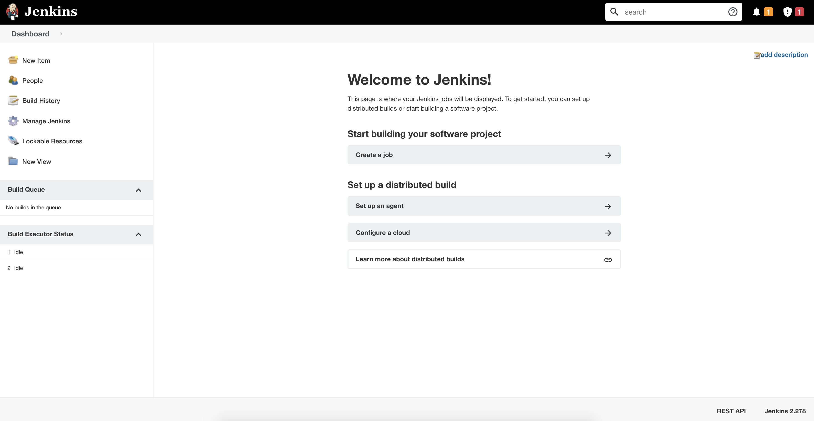

# Section 1: the first script: build the Pipeline as Code script

## 1. Fork the repository

> Note: if you are using a workstation you won't need to clone the repo but instead add the forked repo as a new remote origin to push your code to. So within your workstation make sure you cd into `workdir` and then cd again into `Hands-on-with-Jenkins-Terraform-and-AWS`. We will run through the git setup before pushing a little later.

First of all, you will need your own repository to commit your code so please [fork this repo](https://github.com/DevOpsPlayground/Hands-on-with-Jenkins-Terraform-and-AWS) and clone to your local machine. You will see the `fork` option in the top right of your screen:

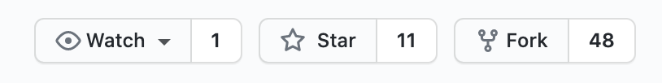

Copy the URL of the repository:

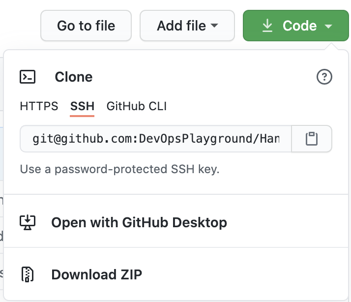

In your terminal run:
```
$ git clone <REPOSITORY_URL>
$ cd <REPOSITORY_URL>
```

Replace `<REPOSITORY_URL>` with your forked repo URL

Navigate to the forked repository and click in the `jobs` folder. You should see an empty file called `DeployReactApp.groovy`

## 2. Copy and paste the code below into the file

These instructions will be using VS Code and terminal but feel free to use the GitHub UI to update and save files.

> **IMPORTANT:**  replace the UNIQUE_ANIMAL_IDENTIFIER `defaultValue` "changeme" to the one detailed in the terraform output e.g. `funny-panda`. You need to do this within the `Deploy-React-App` pipeline as well as the `Destroy-React-App` pipeline.

```
pipelineJob("Deploy-React-App"){
    description("Deploys a React web application to AWS")
    logRotator {
        daysToKeep(5)
        numToKeep(20)
    }
    concurrentBuild(allowConcurrentBuild = false)
    triggers {
        scm("* * * * *"){
            ignorePostCommitHooks(ignorePostCommitHooks = false)
        }
    }
    parameters {
      stringParam("UNIQUE_ANIMAL_IDENTIFIER", defaultValue = "changeme", description = "Your unique animal identifier for this playground!")
    }
    definition {
    cpsScm {
      scm {
        git {
          branch("master")
          remote {
            credentials("${GIT_USER}")
            url("${GIT_URL}")
          }
        }
      }
      scriptPath('Jenkinsfile')
    }
  }
}
pipelineJob("Destroy-React-App"){
    description("Destroys a React web application to AWS")
    logRotator {
        daysToKeep(5)
        numToKeep(20)
    }
    concurrentBuild(allowConcurrentBuild = false)
    parameters {
      stringParam("UNIQUE_ANIMAL_IDENTIFIER", defaultValue = "changeme", description = "Your unique animal identifier for this playground!")
    }
    definition {
    cpsScm {
      scm {
        git {
          branch("master")
          remote {
            credentials("${GIT_USER}")
            url("${GIT_URL}")
          }
        }
      }
      scriptPath('destroy.Jenkinsfile')
    }
  }
}
```

# Whats happening here?
#### a. `pipelineJob("Deploy-React-App"){}`

The `pipelineJob(){}` block specifies that we want our CI/CD pipeline to be of type "pipeline". There are many types of Jenkins pipelines to choose from, such as:

- Freestyle project
- Pipeline (the one we'll be using)
- Maven project
- Multi-configuration project
- Multibranch pipeline

which would all require different syntax.

#### b. `description("Deploys a React web application to AWS")`

This is purely for clarity so people who use this pipeline actually know what it does.

#### c. `logRotator {daysToKeep(5)numToKeep(20)}`

When a build is triggered, it creates an instance of that pipeline, or a "job". These jobs have logs which are necessary for debugging and other purposes.

The `logRotator{}` block specifies how many job logs you want to keep, and for how many days they should be kept. The numbers will vary depending on the requirements, so we'll just leave it at 5 and 20.

#### d. `concurrentBuild(allowConcurrentBuild = false)`

There are many instances when you would want to **allow** concurrent builds, such as if multiple engineers were using the same pipeline to deploy to different components in different environments at the same time, but that won't be necessary for this pipeline so we'll disallow it.

#### e. `triggers {}`

With the `triggers {}` block we can automate the jobs by specifying when we want it to be built. The `* * * * *` inside the `scm()` function tells Jenkins to check the application repository every minute. If there has been a code change to the master branch in that minute, it will trigger a build.

#### f. `parameters {}`

the `parameters {}` block allows us to define any parameters we want our pipeline to accept. We are using your `UNIQUE_ANIMAL_IDENTIFIER`, so that everyone had a unique domain name and can therefore visit their deployed website with no duplicates.

#### g. `definition {}`

Here we are using the `definition {}` block to specify the Git repository. You will notice two variables that we will be passing into the seed job when we build it:

- `GIT_USER`: this will be the credentials to your personal GitHub account so Jenkins can clone the repo (don't worry, we haven't configured this yet).
- `GIT_URL`: this is the url of your forked [react-app-devops-playground](https://github.com/DevOpsPlayground/Hands-on-with-Jenkins-Terraform-and-AWS) repository.

The `scriptPath('')` function defines the file path to the pipeline script that will be used to deploy our application. We'll come back onto this in Section 3

#### h. `pipelineJob("Destory-React-App"){}`

This `pipelineJob(){}` is creating a second pipeline that we will use to destoy the infrastructure we have created. The `scriptPath('')` function here is defining a separate file path to the `destroy.Jenkinsfile` script.

# How to commit and push to master?

1. If you haven't already done so, clone down your **forked** [react-app-devops-playground](https://github.com/DevOpsPlayground/Hands-on-with-Jenkins-Terraform-and-AWS) repository and cd into it. 

> Note: remember, if you are using a workstation, make sure you cd into `workdir/Hands-on-with-Jenkins-Terraform-and-AWS` if you haven't already done so

2. Open the repository in your text editor (I'm using VS Code) and click on the DeployReactApp.groovy script within the jobs directory.

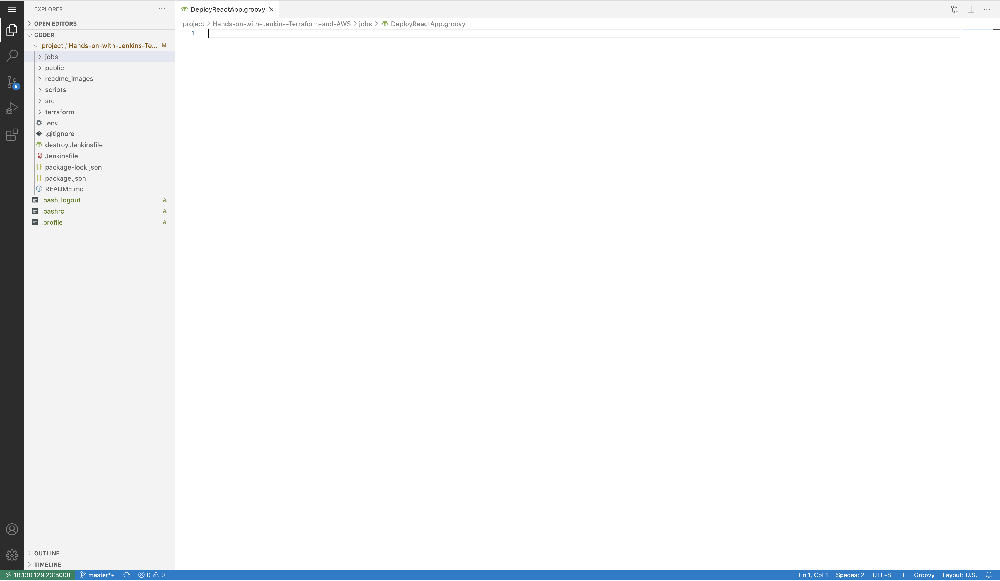

3. Copy the entire script and paste it into the file. Make sure the `defaultValue` of `UNIQUE_ANIMAL_IDENTIFIER` has been changed.

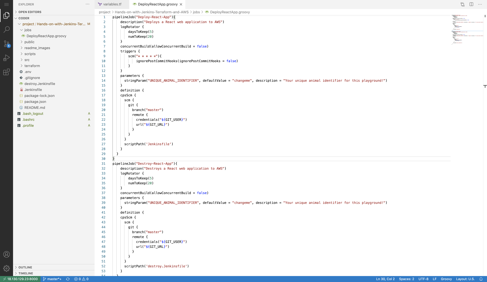

4. Before we commit, we just need to do some git configuration:

If you are using a workstation you will need to configure git by typing:
```
git config --global user.name "Your Name"
git config --global user.email "youremail@domain.com"
```
> Note: you do not need to provide your real name or email address

If you are using provided workstations you will need to authenticate to push. We advise you to use GitHub access token.

When the command line prompts you for your password, you can just paste your access token instead of your password and it will authenticate you:

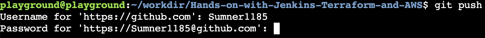

## How to generate an access token from GitHub

* Go over to your GitHub and click the dropdown arrow next to your profile picture at the top right. Then click `Settings`

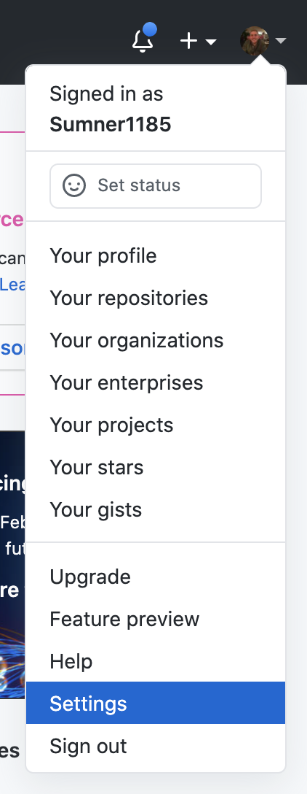

* Scroll down and click `Developer settings` on the left
* Click on `Personal access tokens` and `Generate new token`

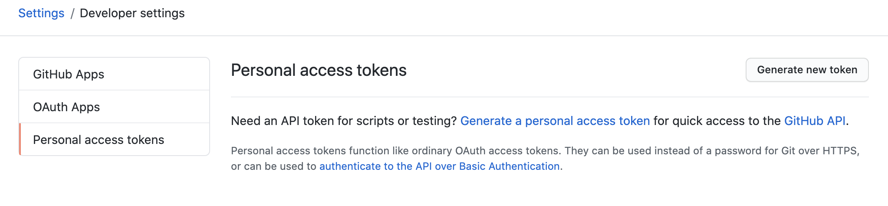

* This will take you to a page where you'll need to define the name and permissions of your token. Call the token "jenkins" and give full `repo` and `user` permissions. Then click `Generate token`:

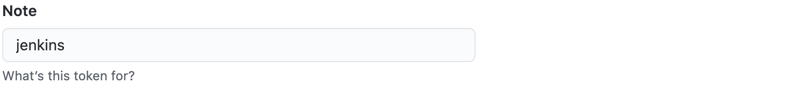
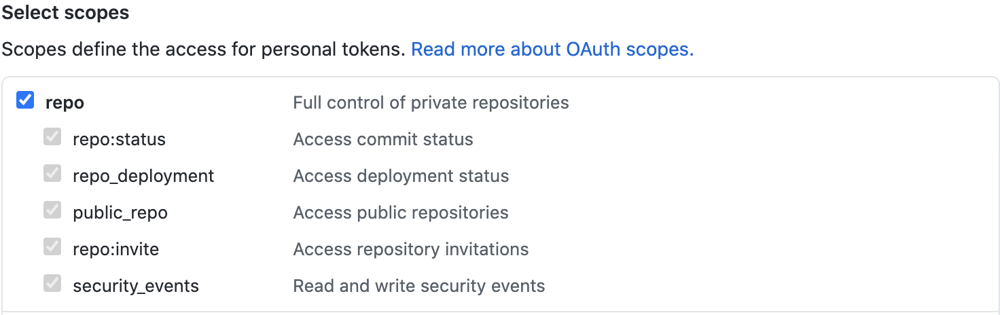
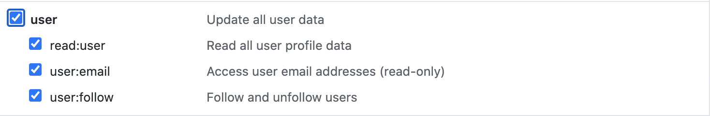


* This will take you to a page where your token will be displayed

> IMPORTANT: you will only be shown your token once, so copy it by clicking that little clipboard to the right of the token and save it on your machine somewhere. We'll not only need it for the command line authentication, but also for the next section.
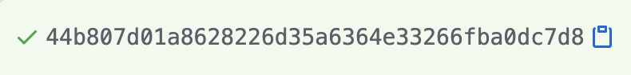

Now run the following commands to push up to your master or main (check in your repo which naming convention has been used) branch.
```
git add .
git commit -m "Populating the Jenkins seed job script"
git push -u origin master/main
```
And as mentioned before, you can paste your access token straight into the command line when it prompts you for your password.

Now let's move onto section 2...

# Section 2: Configure Jenkins and then build the seed job.

In this section we will:
* Add our GitHub credentials to Jenkins globally so that it can interact with our repositories.  
* Configure Jenkins to use NodeJS so it can build and test our React application.
* Configure Jenkins with Terraform so it can run `terraform` commands.
* Configure Jenkins with AWS so it can deploy our application.

Let's dive straight in...

### 1. Configure GitHub access token gloablly

Once logged into Jenkins, click...
* `Manage Jenkins > Manage Credentials`
* Click `Jenkins` under `Stores scoped to Jenkins`

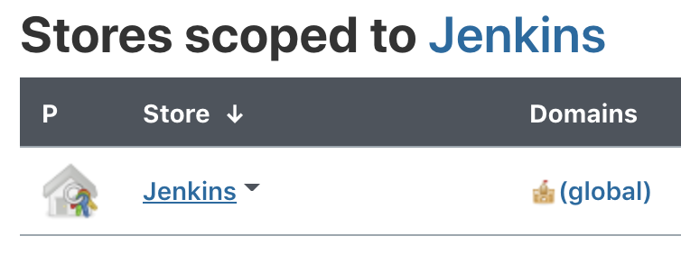

* Click `Global credentials`

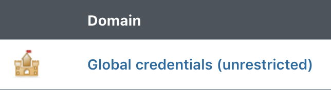

* Click `Add Credentials` on the left 


* Leave the scope as `Global` and fill in the fields like so:
    - `Username`: your GitHub username
    - `Password`: the access token we just generated in GitHub
    - `ID`: your GitHub username
    - `Description`: "git credentials"
> **IMPORTANT: make sure you put your username in the ID section**. 

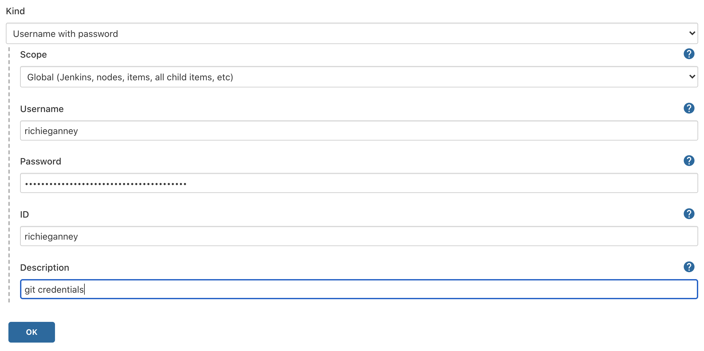

### 2. Configure Jenkins to use NodeJS so that our application pipeline can use `npm` commands.

All of the plugins for this playground have been pre-installed on your Jenkins server, we just need to tell Jenkins to use them now.

- Go to the Jenkins homepage and navigate to `Jenkins > Manage Jenkins > Global Tool Configuration`


- Scroll down and select `NodeJS installations...`


- Select `Add NodeJS` and fill in the fields with the following details:
    - Name: `nodejs`
    - Install automatically: (box checked)
    - Version: (leave as default)
    - Global npm packages to install: `leave it blank`
    - Global npm packages refresh hours: `72`


- Click `Apply`

### 3. Configure Jenkins to use Terraform so that our application can use `terraform` commands.

- While we are still in the `Global Tool Configuration` part of Jenkins, scroll down past the NodeJS installations and click `Terraform installations`


- Select `Add Terraform` and fill in the fields with the following details:
    - Name: `terraform`
    - Install Automatically: (box checked)
    - Version: please choose the latest stable release. [Click here](https://www.terraform.io/downloads.html) for details.


- Click `Save` which will take you back to the homepage.

### 4. Configure Jenkins with an AWS region so it knows where to deploy it to. Navigate to:

- `Manage Jenkins > Configure System`


- Scroll down to where is says `Global properties` and check the box that says `Environment variables`


- Fill in the fields with the following information:
    - Name: `AWS_DEFAULT_REGION`
    - Value: `eu-west-2`


- Click save and we are done with the Jenkins configuration!

Now we have added NodeJS, Terraform and AWS to our Jenkins, let's go ahead and actually create the seed job...

### 5. Create a new item

This will hold the Groovy code that will build our CI/CD pipeline.

- Click `New Item` located at the top left of the window.
- Name the item `seed-job` and select `Freestyle project` as the option. Hit `OK`. 


- Now we need to configure this pipeline:
    - Select `This project is parameterized` and add `TWO` string paramters by clicking `Add Parameter > String Parameter` 
    - Add the two variables we saw in Section 1, which were `GIT_USER` and `GIT_URL`. Leave `Default Value` and `Description` blank.
    - In the `Source Code Management` section, select the `Git` radio button. Fill in `Repository URL` with your forked [react-app-devops-playground](https://github.com/DevOpsPlayground/Hands-on-with-Jenkins-Terraform-and-AWS) repository and `Credentials` with your credentials that we configured earlier.  Leave the branch as master or main.
    - Lastly, we need to add a build step. In the `Build` section, select `Add build step > Process Job DSLs`. Fill in the `DSL Scripts` section with the file path to our DSL script. The path is `jobs/DeployReactApp.groovy` and it will look like this: 
    Click `Save` and the configuration is done!

Before we move onto part three of this section, we need to fork the [react-app-devops-playground](https://github.com/DevOpsPlayground/Hands-on-with-Jenkins-Terraform-and-AWS) repository, which is the one that holds the application code we need to deploy.

So in the same way we forked the Jenkins DSL repository earlier, follow the link above and fork it to your personal GitHub. We will need the URL of this forked repository in just a moment...

### 6. Build the seed job with parameters

Now go back to Jenkins so we can trigger a build to create our CI pipeline.

- Click the `seed-job` we just created, then select `Build with Parameters` on the left.


- Fill in the fields like so:
    - `GIT_USER`: the username to your personal GitHub
    - `GIT_URL`: the url of the *forked* [react-app-devops-playground](https://github.com/DevOpsPlayground/Hands-on-with-Jenkins-Terraform-and-AWS) repository. The image below shows how you can copy the url to your clipboard from the GitHub interface. 
- Select `Build`

We should have a successful build. The most recent ball under `Build History` should be blue. If you click that ball you'll see the following message in the logs.

```
Existing items:
    GeneratedJob{name='Deploy-React-App'}
Finished: SUCCESS
```

If you go the Jenkins homepage (you can always do this by clicking the large `Jenkins` icon at the top left of the user interface) you'll see our new pipeline `Deploy-React-App` which will have all the configuration we need.

Now all we need to do is populate the `Jenkinsfile` and the `variables.tf` file in the forked [react-app-devops-playground](https://github.com/DevOpsPlayground/Hands-on-with-Jenkins-Terraform-and-AWS) repository, commit the code, and watch it deploy our application.

Onto Section 3...

# Section 3: populate the `Jenkinsfile` and the `variables.tf` file.

1. Similar to how we populated the Jenkins DSL script, copy the code below paste it into the `Jenkinsfile` located in the root of this directory.

```
pipeline {
    agent any
    tools {
        nodejs "nodejs"
        terraform "terraform"
    }
    stages {
        stage("Build") {
            steps {
                script {
                    sh """
                    npm install
                    npm run build
                    """
                }
            }
        }
        stage("Test") {
            steps {
                script {
                    sh script: "npm test", returnStatus: true
                }
            }
        }
        stage("Deploy") {
            environment {
                ARTIFACT = sh (returnStdout: true, script: 
                """
                aws s3api list-buckets --query 'Buckets[].Name' | grep -wo "\\w*playgroundartifact\\w*" | cut -d" " -f2
                """
                ).trim()
                TFSTATE = sh (returnStdout: true, script: 
                """
                aws s3api list-buckets --query 'Buckets[].Name' | grep -wo "\\w*playgroundtfstate\\w*" | cut -d" " -f2
                """
                ).trim()
            }
            steps {
                script {
                    sh """
                    zip -r $UNIQUE_ANIMAL_IDENTIFIER-build-artifacts.zip build/
                    aws s3 cp $UNIQUE_ANIMAL_IDENTIFIER-build-artifacts.zip s3://${ARTIFACT}
                    cd terraform
                    terraform init -no-color -backend-config="key=${UNIQUE_ANIMAL_IDENTIFIER}.tfstate" -backend-config="bucket=${TFSTATE}"
                    terraform apply --auto-approve -no-color -var ARTIFACT=${ARTIFACT}
                    """
                }
            }
        }
        stage("Show Domain") {
            steps {
                script {
                    sh script: "bash ${WORKSPACE}/scripts/display-dns.sh ${UNIQUE_ANIMAL_IDENTIFIER}", returnStatus: true
                }
            }
        }
    }
    post {
        cleanup {
            deleteDir()
        }
    }
}

```
# What's happening here?

### a. `pipeline {}`

All valid declarative pipelines must be enclosed within a `pipeline {}` block

### b. `agent any`

The agent section specifies where the entire Pipeline, or a specific stage, will execute in the Jenkins environment depending on where the agent section is placed. The section must be defined at the top-level inside the pipeline block, but stage-level usage is optional.

By writing "any" in the agent section we are telling Jenkins to run on any of the available nodes.

### c. `tools {}`

For this particular project, we'll need to use `npm` (node package manager) to build and test the application. This means we need to use a NodeJS installation in order to execute the `npm` command.

We also need to add the `terraform` into this block so that the pipeline can use terraform commands.

The "nodejs" and "terraform" strings are the installations that we configured on the Jenkins server in the previous section.

### d. `stage {}`

The stages section is where the bulk of the "work" described by a Pipeline will be located. At a minimum, it is recommended that stages contain at least one stage directive for each discrete part of the continuous delivery process, such as Build, Test, and Deploy.

For the "Build" and "Test" stages, we simply execute an `npm` command that will run in the workspace directory.

However for the "Deploy" stage we execute some terraform commands which do the following:
- `aws s3api list-buckets --query 'Buckets[].Name' | grep -wo "\\w*playgroundartifact\\w*" | cut -d" " -f2`: the `environment` section creates two environment variables that can be used within our Jenkins pipeline. Using these two commands we search for the artifact name and tfstate name.
- `zip -r $UNIQUE_ANIMAL_IDENTIFIER-build-artifacts.zip build/`: compresses the build package and gets it ready to ship to the artifacts S3 bucket.
- `aws s3 cp $UNIQUE_ANIMAL_IDENTIFIER-build-artifacts.zip s3://dpg-november-artifact-bucket`: copies the zipped up build package and sends it to the artifact bucket. Terraform will be able to then pull this down and unzip it for the deployment
- `terraform init -backend-config="key=${UNIQUE_ANIMAL_IDENTIFIER}.tfstate`: this initializes terraform and tells terraform that we want to hold the [state](https://www.terraform.io/docs/state/index.html) in your uniqe state file.
- `terraform apply --auto-approve`: this will apply the infrastructure that we have defined in the `terraform/` directory of this repository.

The "Show Domain" stage runs a script that you can have a look at in the `scripts/` directory of this repo. It passes your unique animal identifier to the script as an argument (the one we defined in the Jenkins DSL section) and runs an AWS CLI command to find your domain based on your animal value. At the end of the build you will see the domain at the bottom of the logs.

### e. `post {}`

The `post` section defines one or more additional steps that are run upon the completion of a Pipelines or stages run.

The `cleanup` runs after every other post condition has been evaluated, regardless of the Pipeline or stages status.

`deleteDir()` is a function built by jenkins that recursively deletes the current directory and its contents. This will help keep our workspace clean.

That is all we need to for the pipeline script. Let's go ahead and add the changes to the Jenkinsfile. There are a couple of other files we need to change, so we'll do that all in the next part...

### 2. Make changes to `Jenkinsfile` and the `variables.tf` file.

- Copy the entire script from this section and paste it into the `Jenkinsfile`


- Now navigate to the `terraform/` directory located in the root directory of this repo and open the `variables.tf` file. Change the default value of the following variable
    - `UNIQUE_ANIMAL_IDENTIFIER`: your animal for this playground e.g. `happy-panda`.


By changing this variable here we don't have to edit multiple files. Terraform will pass this value to the necessary files.

### 3. Commit the code and push to the master branch.

We should now have made changes to the following files:
- `Jenkinsfile`
- `terraform/variables.tf`

Also, feel free to have a look at the files where the two variables you changed are being used...

- `terraform/main.tf`
- `terraform/modules/autoscaling_group/iam.tf`
- `terraform/modules/autoscaling_group/main.tf`
- `terraform/modules/elastic_load_balancer/main.tf`
- `terraform/scripts/deploy-react-application.tf`
- `scripts/display-dns.sh`

Now commit the code and push to master by running the following commands in the root directory:

```
git add .
git commit -m "Populating the Jenkinsfile script and the terraform variables"
git push -u origin master
```

# Section 4: check deployed logs and visit website.

Now that we have pushed the changes, let's go back to Jenkins to see if the `Deploy-React-App` pipeline has a build running.

### 1. In Jenkins, click on the `Deploy-React-App` pipeline.
### 2. Under `Build History` you should see a build that has just been triggered.
> Note: It may or may not be running/complete just yet so just wait a moment for the most recent logs to appear.
### 3. Once your build has completed, click on the blue ball icon to go straight to the build logs.


You should see the output of all the various stages of our deployment.

### While we wait..

It should be a couple of minutes until the website is live. While we wait, lets go through whats happening from an end to end perspective.

### End to end

1. A build folder is created which packages up our application.
2. We zip up that folder and send it off to Amazon S3.
3. Terraform is initialised and provisions a load balancer and an autoscaling group into a virtual private cloud (VPC)
4. When the infrastructure is provisioned, the deployed servers will pull down that build zip file and unzip it.
5. The build package is then ultimately served on port 80 (http://), which allows the public to visit and use the website.

### Our infrastructure
- `load balancer`: this will distribute traffic across our servers depending on the health and utilisation of those servers. If one is in poor health, it will redirect traffic to a healthy one.
- `autoscaling group`: this will automatically scale our application up/down depending on how we configure it. If we have an unexpected surge in traffic, it will provision more servers to make the application more available

### 4. At the bottom of the logs, you'll see the following message:
```
Application successfully deployed! Please visit http://<ELB_DOMAIN_NAME> in your browser to view it.
```
Click the link to see the deployed website!
> Note: it will take a couple of minutes for the application to deploy, so don't be alarmed if the link isn't working just yet. It will!

AWS lets you utilise resources such as [Amazon Route 53](https://www.google.com/search?q=route+53+aws&oq=route+53+aws&aqs=chrome..69i57j0l5j69i60l2.3169j0j7&sourceid=chrome&ie=UTF-8) to set up domains to your websites. Check out the link above for the documentation.

### 5. Clean up

Once you have finished with the playground and enjoyed seeing the running React application in your browser we need to destroy all the infrastructure that we created within AWS. This will need to be done in two stages as we need to destroy the infrastructure that our Jenkins pipeline created and then we must destroy the infrastructure we created to run the playground itself.

Navigate back to `Dashboard` in the top left of your screen. From there you will see the three pipelines that you created:


Click on the `Destroy-React_App` pipeline and then select `Build with parameters` and you will see your unique identifier detailed. Hit `Build` and the pipeline will start.


Once the pipeline has run and you have `Finished: success` the infrastructure has all been destroyed and we can move on to the final destroy.

Make sure you are in the `November` folder and run the following command:
```
$ terraform destroy
```

The command does exactly what it says on the tin. Infrastructure managed by Terraform will be destroyed. This will ask for confirmation before destroying, so please type `yes` when prompted.

**Again, you will continue to be charged by AWS if you do not run this final step**

We hope you enjoyed the playground DIY and make sure to keep coming back for more great content.

#### Inputs

| Name | Description | Type | Default | Required |
|------|-------------|------|---------|:--------:|
| InstanceRole | The Role of the instance to take | `number` | `null` | no |
| PlaygroundName | The playground name to tag all resouces with | `string` | `"nov"` | no |
| deploy_count | Change this for the number of users of the playground | `number` | `1` | no |
| instance_count | The amount of versions of the infrastructer to make | `number` | `1` | no |
| instance_type | instance type to be used for instances | `string` | `"t2.medium"` | no |
| instances | number of instances per user | `number` | `1` | no |
| policyLocation | The location of the policys | `string` | `"./../../policies"` | no |
| region | The aws region to deploy to | `string` | `"eu-west-2"` | no |
| scriptLocation | The location of the userData folder | `string` | `"./../../modules/instance/scripts"` | no |

#### Outputs

| Name | Description |
|------|-------------|
| jenkins_ips | The ip of the jenkins instances |

