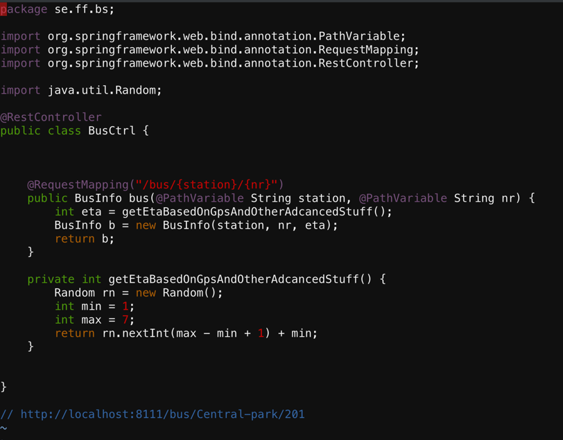
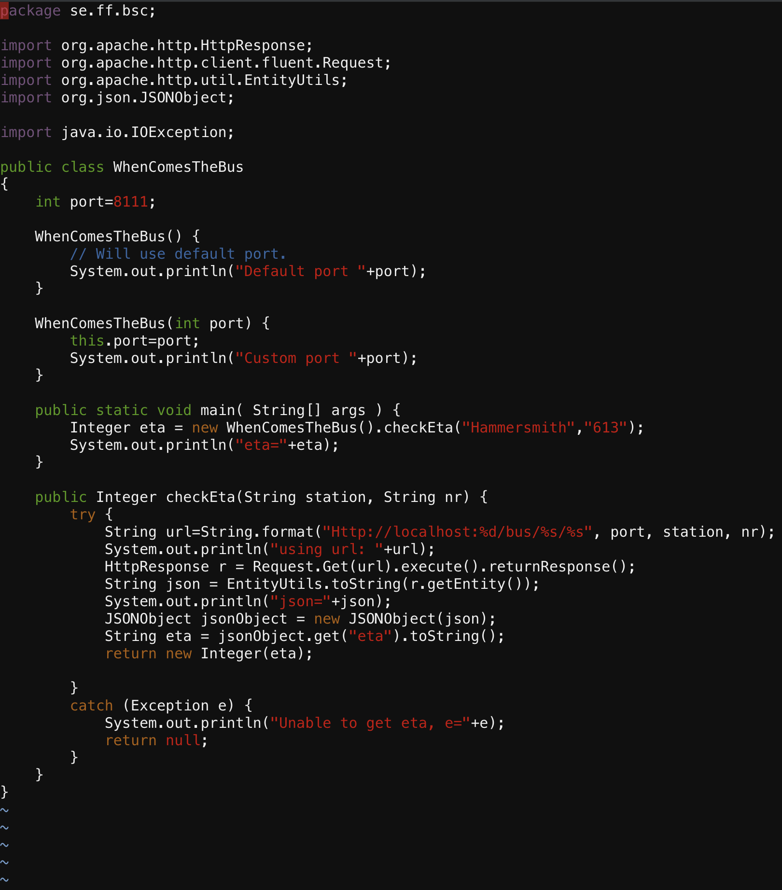
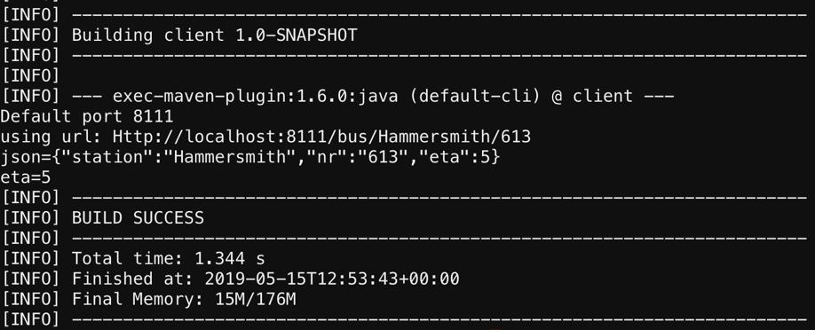
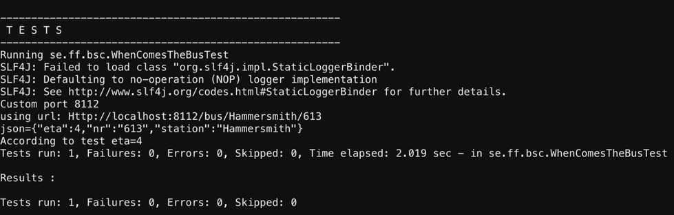
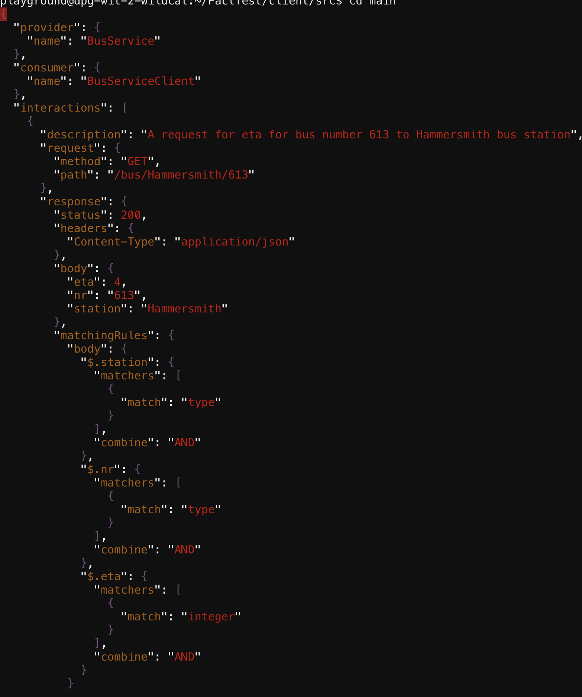
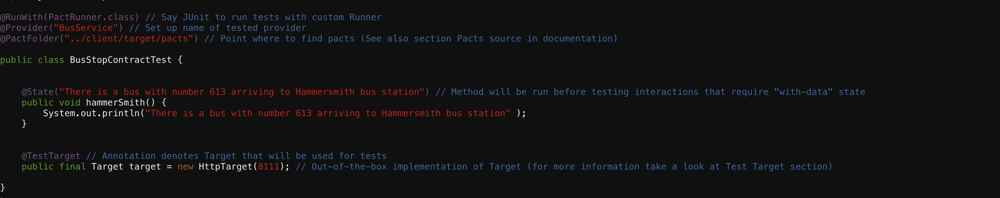
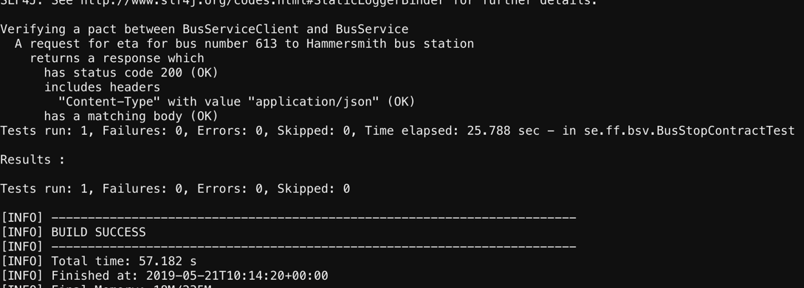
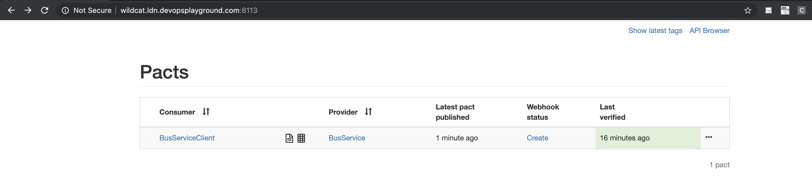
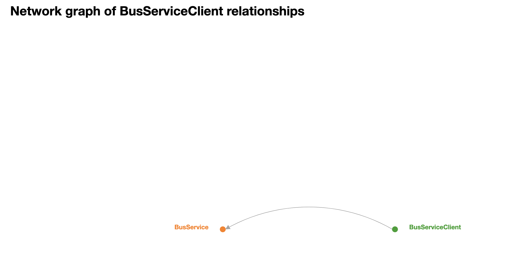

<p align="center">

</p>

<h1 align="center">Welcome to the October playground! Digital Women in Tech: Hands on with Contract Testing</h1>

[The Playground link](https://github.com/DevOpsPlayground/Digital-Women-in-Tech---Hands-on-with-Contract-Testing.git)

# Intro  

Hello and welcome to the October - Digital Women in Tech playground DIY.  

In this playground you're going tp  walk you through what Contract testing is. We will explain how PACT works and do a hands-on workshop creating a pact between two micro services and testing it.  

Let's get started!

# Check Before You Start!  

We will be building the required infrastructure using Terraform so if you do not have this currently installed please [visit the Hashicorp website](https://learn.hashicorp.com/tutorials/terraform/install-cli) for how to do this.

**All infrastructure will require an AWS account so please make sure you have run through the installation process for AWS CLI and AWS config in the [root README.md file](../../README.md)**

## Important:  

Before we get started there are a few things that are worth noting. We have set the defaults to a number of variables that can be changed within the `variables.tf` file if required:

* The current code will build a single EC2 instance one for a workstation
* The workstation instance and remote host will run two containers. One with the project directory uploaded and wetty installed allowing SSH from the web. The other has VS Code installed providing a text editor to amend and save changed code.
* If you prefer to use VIM then you can ! If not, you can use the VS Code IDE.
* If you have your own hosted zone set up in Route53 then you can use your own domain for each instance rather than the IPs. To do this uncomment lines `51-67` in `main.tf`, lines `25-31` in `outputs.tf` and lines `23-27` in `variables.tf`
* The default `region` is set to `eu-west-2`
* The default `deploy_count` is set to 1. Change this if you are running the playground for more than one user.
* The default `instance_type` is set to `t2.medium` as the t2.micro does not have enough resource to efficiently run the workstation. This on-demand pricing is $0.0464 per hour (£0.034 per hour) per instance. Should you leave this running for 1 month (720 hours), you would be charged $33.63 (£24.48) per instance. **make sure you delete the instance when finished with the playground!**

# Build Infrastructure  

Make sure you are in the `WIT_October_2020` directory and run:

```
$ terraform init
```    
This will initialise a working directory containing our Terraform configuration files. This command is always safe to run multiple times, to bring the working directory up to date with changes in the configuration. You should see the following:

<p align="center">

</p>  

Then run:
```
$ terraform plan
```  

This command is used to create an execution plan. Terraform performs a refresh, unless explicitly disabled, and then determines what actions are necessary to achieve the desired state specified in the configuration files.  

This command is a convenient way to check whether the execution plan for a set of changes matches your expectations without making any changes to real resources or to the state. For example, terraform plan might be run before committing a change to version control, to create confidence that it will behave as expected. The plan will be fairly long but if all went well you should see the following in your terminal:

<p align="center">

</p>  

Finally you need to run:
```
$ terraform apply
```  

This command is used to apply the changes required to reach the desired state of the configuration, or the pre-determined set of actions generated by a terraform plan execution plan. You will be prompted to enter a value to perform the action. Type `yes` as the value and hit enter.  

Terraform will now build our required AWS infrastructure. This should complete after a minute or so showing the following:

<p align="center">

</p>

> IMPORTANT! - make a note of the `WorkstationPassword` as this is auto-generated and will only be shown once. If lost you may need to build your instance.  

Once the apply has completed your EC2 instance will now be initialising and running the required script(s). Once the `instance state` have changed to `Running` they may take a further 4/5 minutes to install all the required dependencies.

## Access  

To access your instance check outputs in terminal after running `terraform apply`:

* Workstation instance - <workstation_ip>/wetty e.g. 318.130.177.57/wetty  
browser e.g. 18.130.177.57:3000/wetty
* IDE access - <workstation_ip>:8000 in browser e.g. 318.130.177.57:8000
* Workstation password - provided at the end of terraform apply

## Playground  

We have already installed all the requirements to this this playground on the instance if you're curious we have installed the following with a bash script on instance set-up.

- Java
- Maven
- VSCode IDE   

In this playground we assume some basic knowedge of  Linux commands and Java, this is helpful but not needed as all commands and explained.   

We have set some enviroment variables within the instance to make navigation easier as stated before this was done via a shell script: If for some reason these aren't avalable to you please copy the follwing commands.

```bash
echo export BUSAPP="~/workdir/Digital-Women-in-Tech---Hands-on-with-Contract-Testing/bs/src/main/java/se/ff/bs" >> /etc/profile
echo export BUSSPRINGBOOT="~/workdir/Digital-Women-in-Tech---Hands-on-with-Contract-Testing/bs" >> /etc/profile
echo export BUSCOMES="~/workdir/Digital-Women-in-Tech---Hands-on-with-Contract-Testing/client/src/main/java/se/ff/bsc" >> /etc/profile
echo export BUSTEST="~/workdir/Digital-Women-in-Tech---Hands-on-with-Contract-Testing/client/src/test/java/se/ff/bsc" >> /etc/profile
echo export CLIENT="~/workdir/Digital-Women-in-Tech---Hands-on-with-Contract-Testing/client"  >> /etc/profile
echo export BROKER='~/workdir/Digital-Women-in-Tech---Hands-on-with-Contract-Testing/dockerpactbroker'  >> /etc/profile
echo export VERIFY='~/workdir/Digital-Women-in-Tech---Hands-on-with-Contract-Testing/verifyer/src/test/java/se/ff/bsv' >> /etc/profile
```  

3. Lets view the spring boot class that will run our live system which gives an estimated bus arrival time.
    ```
    cd $BUSAPP
    
```   

4. Type or copy/paste
    ```
    vi BusCtrl.java
    
```   
5. The above step will open the class BusCtrl.java in vi terminal, which will look like this.

  

This is the bus application (spring boot) that has a controller, BusCtrl. This service takes station and bus number as input variables and then it uses the method getEtaBasedOnGpsAndOtherAdancedStuff(). This method returns an integer which then creates a BusInfo object with station number and the time left.    
6. To exit the vi editor and return to the current directory use:
 ```
    :q

```  

This will take you back to your present working directory.    

7. Use the below command to go to the Bus Application main directory
```
    cd $BUSSPRINGBOOT

```  
8. Now lets start the spring boot service by giving the below command
```
    mvn spring-boot:run

```   
9. Go to browser/new tab and type **http:// address of your instance:8111/bus/Central_station/60**    

# **Class WhenComesTheBus.java (Client)**    
We can now write our client side test.      
10. Open a new tab in your browser and enter address of your linux instance again and log in.    
11.	Let's view our client side class in vi editor
```
    vi $BUSCOMES/WhenComesTheBus.java

```    
The class WhenComesTheBus.java will open in the vi editor.  

   

This class uses port 8111 as default port. It has the method checkEta() that checks estimated time for the station Hammersmith and bus number 613. It than prints out the results. CheckEta() method looks at local host, port, station and the bus number. It than makes an HTTP request and transform it into json and extract the integer from the result.    

12. To exit the vi editor and return to the current directory use:
 ```
    :q

```   
13.To go to client directory to run the client test use:
```
    cd $CLIENT

```   
14.Let’s run the class WhenComesTheBus.java by typing the command
```
    mvn exec:java -Dexec.mainClass=se.ff.bsc.WhenComesTheBus

```   
15.The class should run and give you the result as below:  



# **Pact Test WhenComesTheBusTest.java**  
Ok let’s now create the pact file.  The test that we are going to write is based on an example I picked from pact-jvm.      
16.	Now let’s write our test class WhenComesTheBusTest.java. I have already created a shell class for that.
```
    vi $BUSTEST/WhenComesTheBusTest.java
```     
17.	You should now see an empty class **WhenComesTheBusTest.java**. Copy the code below and paste it in the vi editor inside the main class. (**Press i to make vi in edit mode**).     
In the code below  we add the pact rule to represent our provider. The hostname and port are optional. If left out, it will default to 127.0.0.1 and a random available port. You can get the URL and port from the pact provider rule.  
 We are using Port 8112 which will create a mock service. And when we run the pact verification method, doTest(), the mock service will get populated with the information that we setup in the Pact annotated method.

```java
@Rule
public PactProviderRuleMk2 provider = new PactProviderRuleMk2("BusService", "localhost", 8112, this);

@Pact(consumer = "BusServiceClient")
public RequestResponsePact createPact(PactDslWithProvider builder) {
    Map<String, String> headers = new HashMap();
    headers.put("Content-Type", "application/json");

    DslPart etaResults = new PactDslJsonBody()
            .stringType("station","Hammersmith")
            .stringType("nr","613")
            .integerType("eta",4)
            .asBody();

    RequestResponsePact result =  builder
            .given("There is a bus with number 613 arriving to Hammersmith bus station")
            .uponReceiving("A request for eta for bus number 613 to Hammersmith bus station")
            .path("/bus/Hammersmith/613")
            .method("GET")
            .willRespondWith()
            .status(200)
            .headers(headers)
            .body(etaResults).toPact();

    return result;
}

   @Test
@PactVerification()
  public void doTest() {
System.setProperty("pact.rootDir","../pacts");  // Change output dir for generated pact-files
        Integer eta = new WhenComesTheBus(provider.getPort()).checkEta("Hammersmith", "613");
        System.out.println("According to test eta="+eta);
        assertTrue(eta >= 0);
    }
```  

In the above code, once the **@PactVerification()** method is run, the mock service will get populated with the information that is setup in the **@Pact** annotated method. In that method we declare the **PactDslJsonBody()**, where we say that we are depending on a string type named ‘station’, string type named ‘nr’ and a integer type named ‘eta’. These are the things that we need from the consumer. We also say that the status should be 200 and the header should be what we have given in **headers.put("Content-Type", "application/json")**.  
In the **@PactVerification()** method, we first set the root directory for the pact file to be created in. In the next step than we use the class WhenComesTheBus at the provider port, which means that it won’t use the live application data but the mock/virtual data. Than the method **checkEta** is called with station name and bus number.    
18.	Save the above code by typing  
```
    :wq

```   
19.	To run the testcase WhenComesTheBusTest.java we need to going back to client directory.       
```
    cd $CLIENT

```   
20.	Type the maven run command below

```
   mvn test

```
    

21.	By running the above pact test will create a json pact file in the location **/client/target/pacts**.    
22.	To view the pact file type the command **vi BusServiceClient-BusService.json**.

```
   vi target/pacts/BusServiceClient-BusService.json

```

# **Pact File**      

23.	By entering the command in the above step, you will see the json pact file in vi editor.  

    
You can see in the above json file that it is a pact between provider **BusService** and a consumer **BusServiceClient**. It contains the description, request method, path, the response and the body. A bit further down there are the **matchingRules**, which verifies that the station and nr matches type and the eta should be of type integer. We have also **providerStates**, which can be used for a test on the provider side.    

24.	To exit the vi editor and return to the current directory use:
 ```
    :q

```   
# **BusStopContractTest(Provider)**  
We run BusStroContractTest.java class to verify that our live system works according to the client specification/contract that is created.    

25.	To view the provier class type:
```
   vi $VERIFY/BusStopContractTest.java

```
    

It contains a **@State("There is a bus with number 613 arriving to Hammersmith bus station")**, which is given in the **WhenComesTheBus.java** class. This state was also given in the pact file as Provider state. The **@state** annotation is given in test to ensure for example to insert something in the database or other things to be in place for this test to work.  I have kept this test simple hence nothing is being inserted in this test and the state is just given as a statement. But if this state is removed entirely from this class, it will fail since in the contract we have given the provider to be in the state of  “There is a bus with number 613 arriving to Hammersmith bus station”.  
**@TestTarget** annotation targets the system to be tested. In the above example we are pointing it to port that the live system is running on. This test also needs to have access to the pact file in order for it to verify in the annotation @PactFolder("../client/target/pacts"). It is also necessary for it to be given the same name in @Provider("BusService") that is in the pact file for the provider.    
Let run this test now.    

26.  Let’s go to main directory verify i.e. **/verifier**.    
27.  To run the provider test use:

```
   mvn test

```   

The result should look like below.



# **Pact Broker**     

We will be using a docker pact broker. I have used an existing pack broker which is running on your linux instance address **<WORKSTATION_IP>:8113**  
    
28.	Open a separate tab on your browser and copy paste your linux instance address
```
 <Linus instance address>:8113

```   
 which should open up your docker compose like below:  
    
29.	Currently your pack broker does not have your pact file. So let’s publish the pact file onto the pact broker. For this we need to go to the client folder. Type:

 ```
   cd $CLIENT

```   

30.	Let’s publish the pact file by giving the command

```
   mvn pact:publish

```   
31.	Go to the tab that has your docker compose running and refresh the page. You should now see your pact file on it as below.   
  

32.	You might have noticed that the pact file is not verified on your broker. In order to verify we need to go to be in the **bs** folder, which has the spring boot application.

```
   cd $BUSSPRINGBOOT

```   
33.	To run the verify the command use:

```
   mvn pact:verify

```    
34.	The above command should verify your pact file on your pact broker. Refresh the tab on which your pack broker is running and it should display the last verified time.     
If you click the link **BusServiceClient**, you will be displayed a graphical image of the BusServiceClient relationship with any other service.

    

Pact broker allows you to release customer value quickly and confidently by deploying your services independently and avoiding the bottleneck of integration tests. It also solves the problem of how to share contracts and verification results between consumer and provider projects.

#### Inputs

| Name | Description | Type | Default | Required |
|------|-------------|------|---------|:--------:|
| InstanceRole | The Role of the instance to take | `number` | `null` | no |
| PlaygroundName | The playground name to tag all resouces with | `string` | `"WIT-OCT"` | no |
| deploy_count | Change this for the number of users of the playground | `number` | `1` | no |
| instance_count | The amount of versions of the infrastructer to make | `number` | `1` | no |
| instance_type | instance type to be used for instances | `string` | `"t2.medium"` | no |
| instances | number of instances per dns record | `number` | `1` | no |
| policyLocation | The location of the policys | `string` | `"./../../policies"` | no |
| rds_db_name | RDS database name | `string` | `"maypanda"` | no |
| region | The aws region to deploy to | `string` | `"eu-west-2"` | no |
| scriptLocation | The location of the userData folder | `string` | `"./../../modules/instance/scripts"` | no |
| username | The default username for the rds instance. | `string` | `"playground"` | no |

#### Outputs

| Name | Description |
|------|-------------|
| WorkstationPassword | The password Used to SSH into the instance |
| subnet_id | n/a |
| unique_identifier | Unique identifiers for Workstation instances |
| workstation_ips | The ip of the workstation instances |

